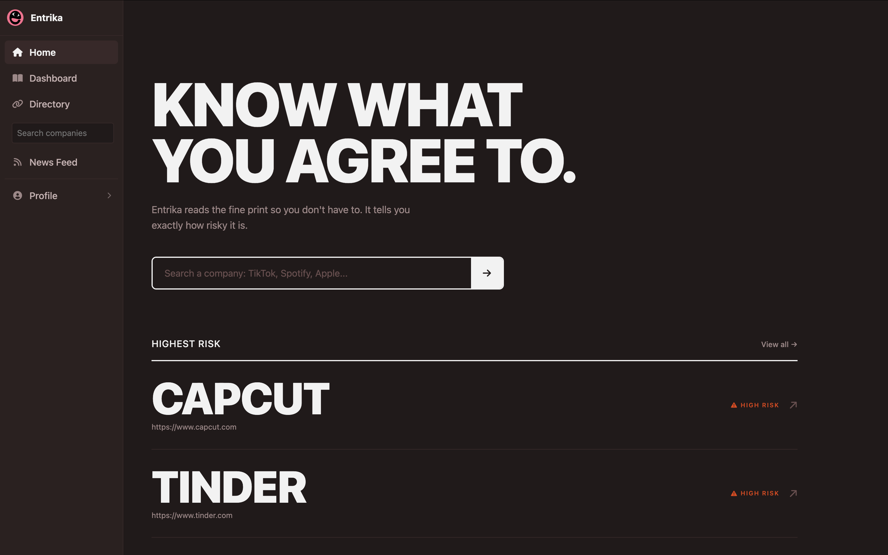
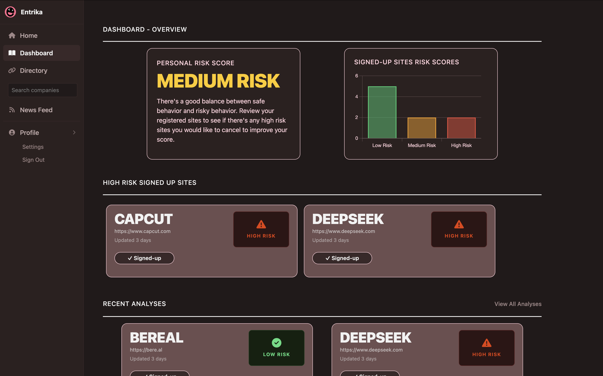
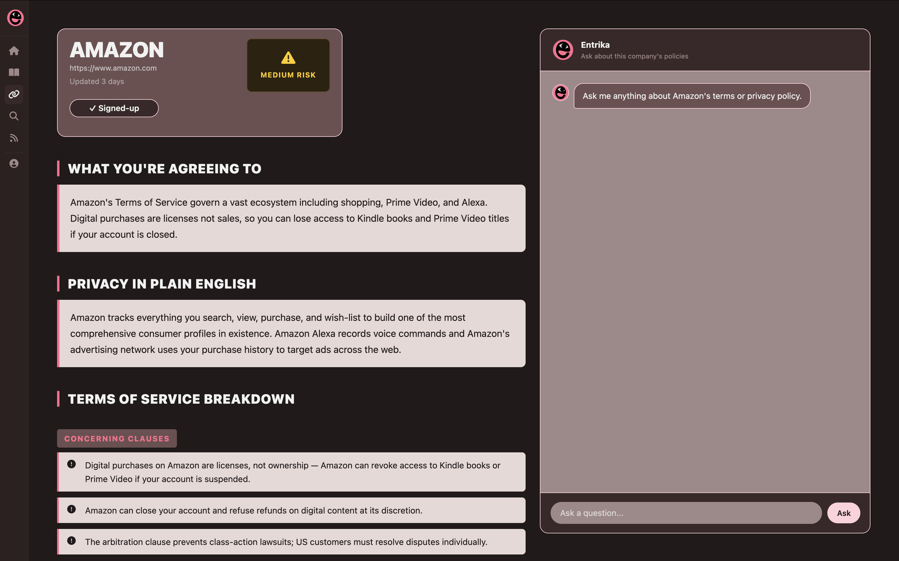
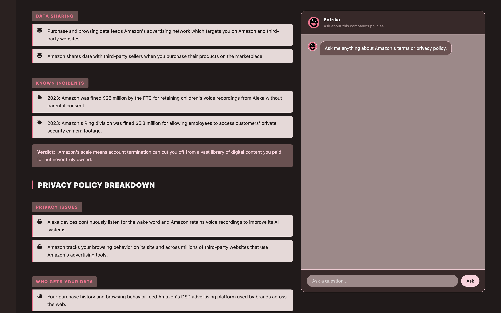
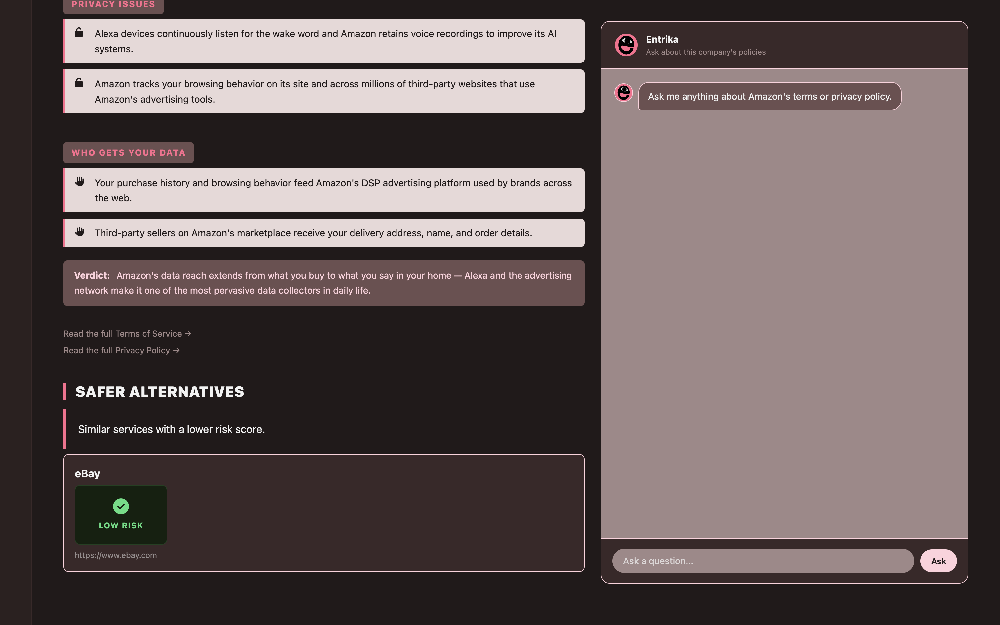
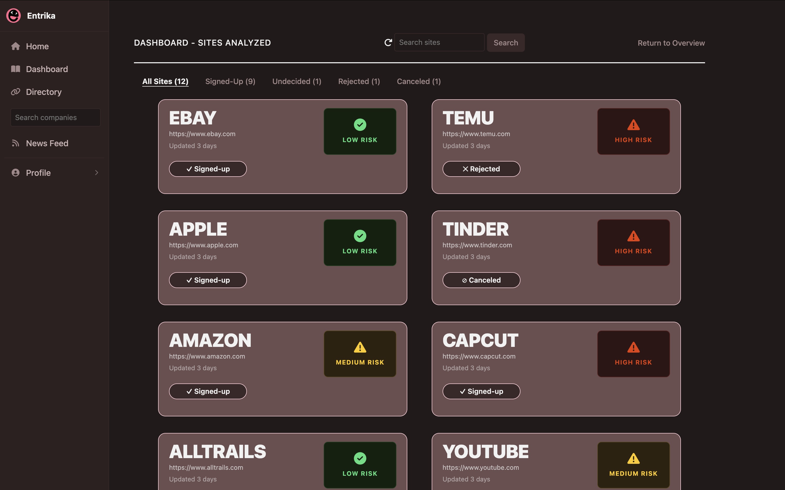
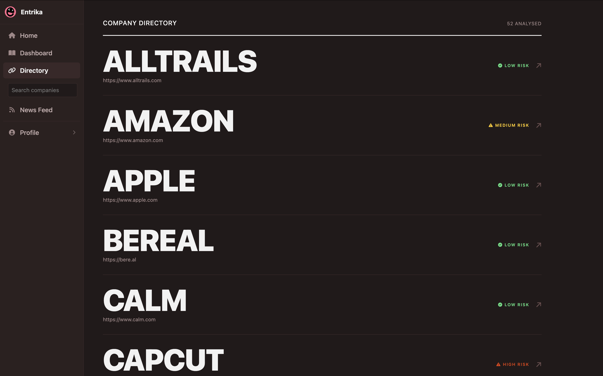

# 📚 Entrika

Reclaim your digital autonomy. Entrika intercepts telemetry, scores ToS agreements, and surfaces trackers before they surface you.
<!-- about -->
<!-- features -->

<br>
App: https://entrika-fd2dab6f0cd8.herokuapp.com/
<br>
Web: https://www.entrika.online/
<br>
<!-- Extension: https://chromewebstore.google.com/your-extension-link -->

<details>
<summary>Screenshots</summary>
<table>
  <tr>
    <td width="50%">
      <h3>Home Page</h3>
      
      <p>Landing page for Entrika. Search for specific sites, view trending or highest risk companies.</p>
    </td>
    <td width="50%">
      <h3>Dashboard</h3>
      
      <p>Users' personal dashboard. Displays their highest risk sites, recent analyses and live, aggregated privacy exposure score.</p>
    </td>
  </tr>
  <tr>
    <td colspan="2">
      <h3>Company Analysis</h3>
      
      
      
      <p>Analysis for specific company site, includes: terms of service and privacy policy breakdowns, privacy red flags, data sharing practices and known incidents. <br> Also, AI conversational UX allows users to ask further questions, plus recommended safer alternatives section.</p>
    </td>
  </tr>
  <tr>
    <td width="50%">
      <h3>Analyzed Sites</h3>
      
      <p>Full ordered list of sites current user has analyzed. Update, and filter sites by, their account status - are they signed up on that site, undecided, canceled their account, or rejected their terms? </p>
    </td>
    <td width="50%">
      <h3>Company Directory</h3>
      
      <p>Every company site ever analyzed on our app or Chrome extension, sorted.</p>
    </td>
  </tr>
</table>
</details>


## Getting Started
### Setup

Install gems
```
bundle install
```

### ENV Variables
Create `.env` file
```
touch .env
```
Inside `.env`, set these variables. For any APIs, see group Slack channel.
```
GITHUB_TOKEN=your_own_token
CLOUDINARY_URL=your_own_cloudinary_url_key
```

### DB Setup
```
rails db:create
rails db:migrate
rails db:seed
rails company:create
rails company:update
```

### Run a server
```
rails s
```

## Built With
- [Rails 8.1.3](https://guides.rubyonrails.org/) - Backend / Front-end
- [Chrome Extension (Manifest V3)](https://developer.chrome.com/docs/extensions/mv3/intro/) — Browser extension
- [Stimulus JS](https://stimulus.hotwired.dev/) - Front-end JS
- [Turbo](https://turbo.hotwired.dev/)- Page navigation and form updates without full reloads
- [ActionCable](https://guides.rubyonrails.rg/action_cable_overview.html) - Real-time WebSocket features
- [ruby_llm](https://github.com/crmne/rby_llm) - AI integration (OpenAI)
- [SolidQueue](https://github.com/rails/solid_queue) - Background job architecture
- [Ferrum](https://github.com/rubycdp/ferrum)  Headless browser scraping
- [HTTParty](https://github.com/jnunemaker/httparty)- HTTP requests / web scraping
- [Nokogiri](https://nokogiri.org/) - HTML parsing  web scraping
- [Devise](https://github.com/heartcombo/devise)- Authentication
- [Pundit](https://github.com/varvet/pundit) - uthorisation
- [Heroku](https://heroku.com/) - Deployment
- [Cloudinary](https://cloudinary.com/) - Media torage
- [PostgreSQL](https://www.postgresql.org/) - Database
- [Bootstrap](https://getbootstrap.com/) — Styling
- [Figma](https://www.figma.com) — Prototyping


## Team Members
- [Ayda Selen Pilancı](linkedin.com/in/ayda-selen-pilanci/)
- [Alain Mimeault](https://www.linkedin.com/in/alain-mimeault-057a343aa/)
- [Anna Costello](https://www.linkedin.com/in/dougberkley/)
- [Archie Millar](linkedin.com/in/archie-millar/)

## Contributing
Pull requests are welcome. For major changes, please open an issue first to discuss what you would like to change.

## License
This project is licensed under the MIT License
